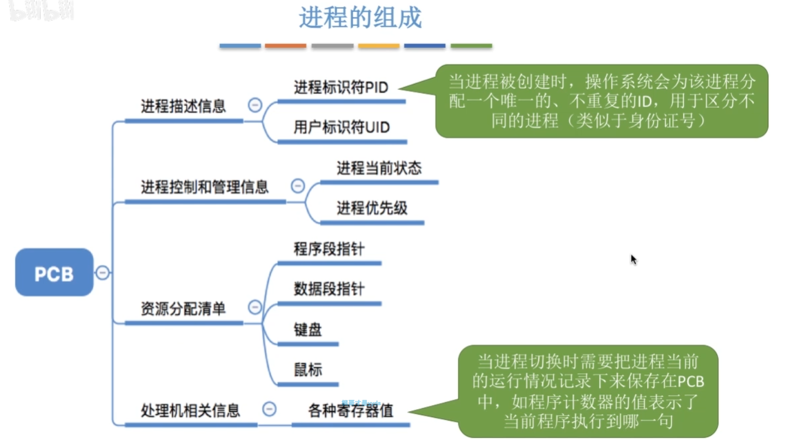
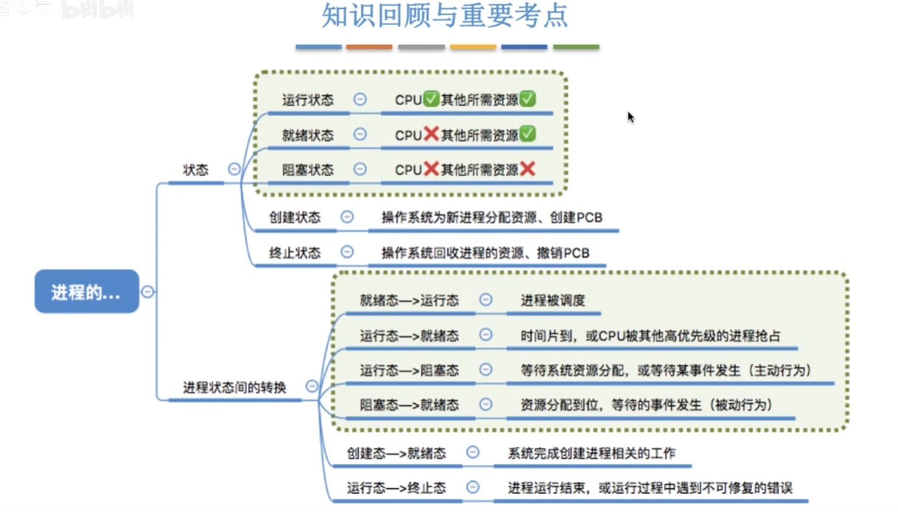

## 2.1 进程的基本概念

### 2.1.1 进程的定义、组成、组织方式、特征

```mermaid
graph LR
Title(进程)--> A(定义)
A-->进程为什么会被引入
Title--> B(组成)
B-->每个进程有哪些部分组成
Title--> C(组织方式)
C-->系统中各个进程之间如何被组织
Title--> D(特征)
D-->相比于程序,进程的特征
```

#### 定义

在仅支持单道程序的年代，**程序**（即指令序列）独占所有CPU、内存、I/O资源。此时程序的代码放在程序段内，程序执行过程处理的数据放在数据段内（如变量）。

引入**多道**程序技术后，允许多个程序并发执行，此时各个程序的代码、运算数据存放的位置不同，并具有间断性和不可再现性的特征。

为了方便操作系统管理，完成各程序的并发执行，引入了**进程、进程实体**的概念，实现操作系统的并发行和共享性。

为了使参与并发执行的程序能独立的运行，必须为之配置一个专门的数据结构，称之为进程控制块**PCB**（Process Control Block），系统利用PCB来描述进程的基本情况和运行状态（如程序代码存放位置），进而控制和管理进程。

**PCB、程序段、数据段**三部分构成了**进程实体**（**进程映像**）。一般情况下，我们把进程实体就简称为进程，例如，所谓创建进程，实质上是创建进程实体中的PCB；而撤销进程，实质上是撤销进程实体的PCB。值得注意的是，进程实体是**静态的**，而进程是**动态的**过程。

从不同的角度，进程可以有不同的定义，比较经典的定义有：

+ 进程是程序的一次**执行过程**；

+ 进程是一个程序及其数据在处理器上顺序执行时所**发生的活动**；

+ 进程是具有独立功能的程序在一个数据集合上**运行的过程**，他是系统进行资源分配和调度的一个独立单位。

可以看出来，这三个定义都特别地强调了一点，即进程是**动态**的过程。

在引入了进程实体的概念后，可把进程定义为：

+ **进程**是进程实体的**运行过程**，是系统进行**资源分配**和**调度**的一个独立单位。

#### 组成

我们已经知道，**进程**（**进程实体**）由**PCB、程序段、数据段**组成，下面我们聊聊PCB的组成。

PCB主要由以下四个部分组成：

+ 进程标识符（PID）：

  当进程被创建时，操作系统会为该进程分配唯一的、不重复的ID，用于区分不同的进程（类似于身份证号）；

+ 处理机状态：

  当进程切换时需要把进程当前的运行情况记录下来保存在PCB中，如程序计数器的值表示了当前程序执行到哪一句；

+ 进程调度信息：

  包括进程当前状态、优先级、等待和使用CPU的时间总和等信息，用作进程调度和对换的依据；

+ 进程控制信息：

  包括程序和数据的地址、进程同步和通信信息、资源清单和进程队列指针等。

#### 组织方式

在一个系统，通常有数十，数百乃至数千个PCB。为了能对他们加以有效的管理，应该用适当的方式把这些PCB组织起来。

注：进程的**组成**讨论的是**一个进程内部**由哪些部分构成的问题，而进程的**组织**讨论的是**多个进程间**的组织方式问题。

进程的组织方式可分为索引方式和链接方式：

+ 链接方式：

  操作系统会持有一系列的指针，每个指针会指向不同状态的进程队列：

  

+ 索引方式：

  与链接方式类似，只不过指针指向的不是一个队列，而是一个索引表，索引表中的表项也是指针，指向不同的进程：

  

#### 特征

进程和程序是两个截然不同的概念，相比于程序，进程拥有以下特征：

### 2.1.2 进程的状态与转换

#### 进程的状态

进程是程序的一次执行。在程序的执行过程中，有时进程正在被CPU处理，有时又需要等待CPU服务。可见，进程的状态是会有各种变化 的。为了方便对于各个进程的管理，操作系统需要将进程合理地划分为几种状态。

进程有三种基本状态：

1. **运行态**（Running）：

   指进程占有CPU，且在CPU上运行的状态。值得注意的是，在单处理器的环境下，每一时刻最多只有一个进程处于运行状态；

2. **就绪态**（Ready）：

   指已经具备运行条件，但由于没有空闲CPU，而暂时不能运行。此时进程已经获得了除CPU之外的一切所需资源，一旦得到处理器即可运行；

3. **阻塞态**（Blocked/Waiting 等待态）：

   进程正在等待某一事件而暂停运行。如：等待操作系统分配打印机、等待磁盘操作的结果。CPU是计算机中最昂贵的部件，为了提高CPU的利用率，需要先将其他进程需要的资源分配到位，才能得到CPU的服务。

另外两种状态：

4. **创建态**（New 新建态）：

   指进程正在被创建，尚未转到就绪状态。在此状态，进程正在被创建，操作系统为进程分配资源，初始化PCB。

5. **终止态**（Terminated 结束态）：

   当进程需要结束运行时，系统首先必须置该进程为结束状态。在此状态，操作系统需要完成撤销进程相关的工作。完成将分配给进程的资源回收，撤销进程PCB等工作。

#### 进程状态的转换

整体的转换过程如下图：

注意：**不能由阻塞态直接转换为运行态，也不能由就绪态直接转换为阻塞态**（因为阻塞态是进程主动请求的，必然需要进程在运行时才能发出这种请求）。

#### 总结

