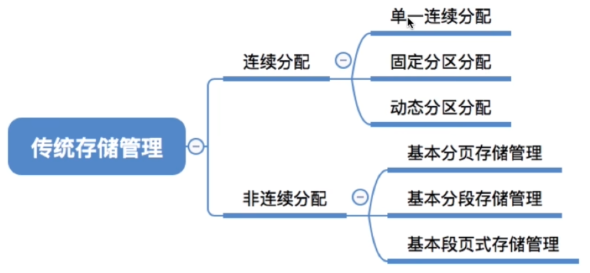

## 5.1 虚拟存储器的基本概念

### 5.1.1 传统存储管理方式的特征、缺点

传统存储管理方式有两个很明显的特征：

+ **一次性**：**作业必须一次性全部装入内存后才能开始运行**；

  > 学的段页式，分页分段啥的，都是为了让进程更有效的全部装入内存

  造成两个问题：

  1. 作业很大时，不能全部装入内存，导致**大作业无法运行**；
  2. 当大量作业要求运行时，由于内存无法容纳所有作业，因此只有少量作业能运行，导致**多道程序并发度下降**。

+ **驻留性**：一旦作业被装入内存，就会**一直驻留在内存**中，直至作业运行结束。事实上，在一个时间段内，只需要访问作业的一小部分数据即可正常运行，这就导致了内存中会驻留大量的、暂时用不到的数据，浪费了宝贵的资源。

这些问题都可以通过**虚拟存储技术**解决。

### 5.1.2 虚拟内存的定义和特征

#### 定义

基于[局部性原理](https://docs.drshw.tech/os/4/3/#%E5%B1%80%E9%83%A8%E6%80%A7%E5%8E%9F%E7%90%86)，在程序装入时，可以将程序中**很快会用到的部分装入内存**，**暂时用不到的留在外存**，就可以让程序开始执行。

程序执行过程中，当所访问的**信息不在内存时**，由**操作系统负责将所需信息从外存调入内存**，然后继续执行程序。

若内存空间不够，由**操作系统负责**将内存中**暂时用不到的信息换出到外存**。

在操作系统的管理下，在用户看来似乎有一个比实际内存大得多的内存，这就是**虚拟内存**。

虚拟内存也是操作系统**虚拟性**的一个体现，实际的物理内存大小并没有变，只是在逻辑上进行了扩充。

**需要注意的是：**

+ 虚拟内存的**最大容量**是由计算机的地址结构（CPU寻址范围）确定的；

+ 虚拟内存的**实际容量** = `min(内存和外存容量之和, CPU寻址范围)`；

  如：某计算机地址结构为32位，按字节编址，内存大小为512MB，外存大小为2GB，则：

  + 该计算机虚拟内存的**最大容量**为：`2^32B = 4GB`；
  + 虚拟内存的**实际容量** = `min(2^32B, 512MB + 2GB) = 512MB + 2GB`；

#### 特征

虚拟内存有以下三个主要特征：

1. **多次性**：无需在作业运行时一次性全部装入内存，而是允许被分成多次调入内存；
2. **对换性**：在作业运行时无需一直常驻内存，而是允许在作业运行过程中，将作业换入、换出；
3. **虚拟性**：从逻辑上扩充了内存的容量，使用户看到的内存容量远大于实际的容量。

### 5.1.2 虚拟内存技术的实现

由于虚拟内存技术允许将一个作业，分多次调入内存，如果采用连续分配方式，会不方便实现。因此，虚拟内存的实现需要建立在**离散分配**的内存管理模式上。

类似[传统非连续分配存储管理](https://docs.drshw.tech/os/4/3/)的三种方式，虚拟内存的实现也可分为三种方式：

它与传统方式的主要区别：

+ 在程序执行过程中，当所**访问的信息不在内存时，由操作系统负责将所需信息从外存调入内存**，然后继续执行程序；（即**请求调页/请求调段** 功能）
+ 若内存空间不够，由操作系统负责**将内存中暂时用不到的信息换出到外存**。（即**页面置换/段置换** 功能）
