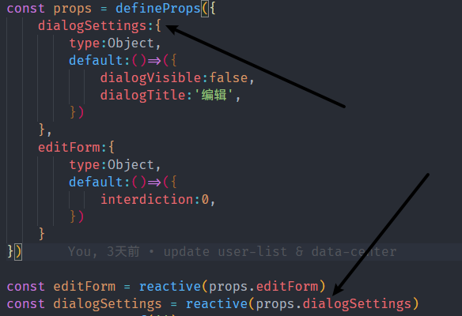

# 2022/10/24看项目视频 
Vuex中的数据，刷新页面就会重新初始化，导致数据丢失。因为 Vuex 里的数据是保存在运行内存中的，当页面刷新时，页面会重新加载 vue 实例，Vuex 里面的数据就会被清空。但是可以通过插件等一些方法持久化数据，还是有解决方法的，后续用到的时候再学 
# 2022/10/24看项目视频
**Vue3的setup()内部无法使用this**,官方解释是：this不会是该活跃实例的引用（即不指向vue实例），因为 setup() 是在解析其它组件选项之前被调用的，所以 setup() 内部的 this 的行为与其它选项中的 this 完全不同。这在和其它选项式 API 一起使用 setup() 时可能会导致混淆。因此所以setup函数中不能使用this，Vue直接将setup函数中的this改为了undefined。个人理解是：setup是在beforecreate和created之前，这时候vue对象还没被创建，所以没法使用this
# 2022/10/28看项目视频
watch要监视对象中的某个具体属性，必须watch(()=>demo.name,(newValue,oldValue)=>{}); 第一个参数必须是一个箭头函数，方法规定就是如此，更深层的要看Vue3源码了
# 2022/10/29看项目视频
Vue跨组件传值真得注意拷贝的问题，JS传对象、数组过去，不注意拷贝，很容易把原对象给改了，然后就传值乱套了，这就不是我们希望的了

# 2022/11/12写GBA游戏重置

可以通过@contextmenu.prevent.stop来禁用浏览器长按右键功能
# 2022/11/13写GBA游戏最快大脑关卡
audio播放音频，用ref获取元素，play()控制播放，pause()暂停，currentTime = 0.0 来控制从头播放

# 2022/11/29邵宇涵写项目
Vue中父子组件生命周期执行顺序：
`父beforeCreate-> 父create -> 子beforeCreate-> 子created -> 子mounted -> 父mounted`
所以子组件挂载完成时父组件还未挂载，所以组件数据回显的时候，在父组件mounted中获取api的数据，子组件的mounted是拿不到的。
解决方案为：在created中发起请求获取数据，依次在子组件的created或者mounted中会接收到这个数据。

# 2022-12-18SASS前端

el-icon如何和文本对齐，加一个属性 vertical-align:-10%;

# 2023-1-4写SASS前端

el-table-column如何得到相应行的数据，可以这么干，使用作用域插槽，这里是结构出了$index得到了索引值，然后就可以通过索引值得到数据了


# 2023-1-4写SASS前端

​	根据瑾知的代码，学到了`Object.assign(对象1，对象2...)`方法，可以将对象2的值浅拷贝到对象1

# 2023-1-7

1. 子组件直接修改父组件**普通**数据

​	使用v-model语法，代替了vue2的.sync修饰符

​	1.父组件定义一个普通数据为响应式变量，例如`const test = ref('parent')`

​	2.父组件用v-model将数据绑定到子组件上

```vue
		<ChildComponent v-model:test="test"/>
```

​	其实它是以下代码的简写

```vue
		<ChildComponent :test="test" @update:test="test = $event"/>
```

​	3.子组件使用emit修改父组件数据

```vue
		//ChildComponent
		<script setup>
            const props = defineProps({
                test:{
                    type:String
                }
            })
            const emit = defineEmits(['update:test'])
            emit('update:test','child')
		</script>
```

> 所以一开始我就想错了，子修改props里的值，一开始就得通过emit自定义事件来实现，所谓的简化是上面的第2步稍微简化了一丢丢

2. 修改复杂数据类型，还是得靠emit自定义事件来实现，但是我发现了一个好玩的事情，文档里写着的，可以更改对象或者数组内部的值，但是不推荐这么做，但是这解决了我看代码的一个小小的问题


# 2023-1-7

文档里写的着，对一个已经存在的代理对象使用reactive()会返回其本身，结合上面那个，可以修改props传过来的对象数组内部的值，当我reactive()接收props传过来的reactive()对象，我修改内部值，最后改的就直接是父组件的值


SASS项目里，写用户列表那个弹出框，子组件代码如下，我就说，我在子组件里更改控制这个弹出框dialog是否出现的值为啥可以不出错一直生效，因为我传进去的是一个reactive代理对象，我用reactive()接，根据上面规则，得到的就是原本的这个代理对象，然后修改，就是改的父组件中这个对象的内部值



​	